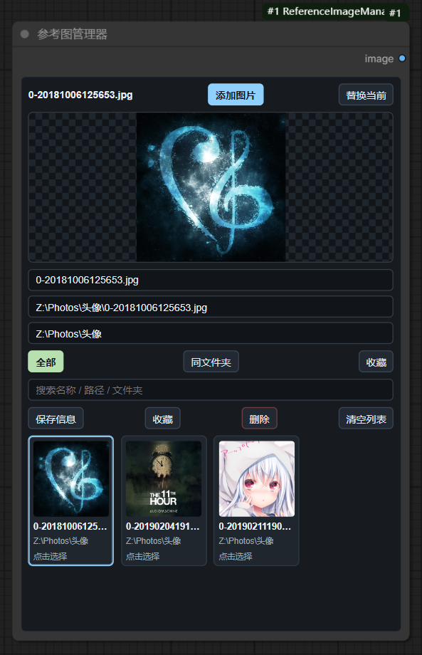

# Advanced Image Loader

English | [简体中文](#简体中文)

## English

An advanced `Load Image` node for ComfyUI. It switches between a reusable image library and an efficient local-folder browser while keeping a standard `IMAGE` + `MASK` interface.



### Features

- **Library**: add multiple images, replace the current entry, search, favorite, rename, remove, and switch by thumbnail.
- **Folder**: choose a local directory, browse it or its subdirectories, open child folders directly, search relative paths, and view 48 images at a time without uploading the folder.
- Sort by natural name, relative path, modification time, file size, or file type. Recursive depth can be set to 4, 8, 16, or 32 levels.
- Directory metadata, filters, and sorted views are cached; only visible thumbnails are decoded, with at most three thumbnail requests running together.
- Recursive scans are bounded by depth, time, folder count, and a 100,000-image ceiling. The node clearly marks partial results instead of blocking indefinitely on very large, deep, HDD, or network folders.
- A selected folder image can be explicitly copied to `input` and added to the Library.
- Original images from folder mode are read only when the workflow executes. Large folders, HDDs, and network paths therefore avoid eager full-image loading.
- Edit the selected image and mask with ComfyUI's native Mask Editor.
- Outputs `IMAGE` and `MASK`. Alpha is converted to ComfyUI's inverted mask convention.
- Library data, source mode, folder path, scan scope, depth, sorting, selected image, page, search text, and edited-image references are stored in the workflow and survive reload, workflow switching, and node duplication.
- English and Simplified Chinese UI.

Images added to the Library use ComfyUI's normal `input` cache. Folder mode never copies a directory into `input`; it copies only the current image when you click **Add to Library** or when the native Mask Editor needs an editable source.

### Folder access security

External-folder browsing is available only from a browser running on the same computer as ComfyUI. The native folder picker grants this node access to the selected root; listing, thumbnails, and imports are confined to that root and use random server-issued capabilities instead of accepting arbitrary image paths.

Folder grants are stored in ComfyUI's local user-data directory, so browser reloads, workflow switching, node duplication, and ComfyUI restarts keep working. The workflow stores only the random grant ID alongside its normal browsing state; on another computer, click **Choose Folder** once to authorize a local replacement. Manually entered paths can navigate only inside the currently authorized root.

### Installation

Install `reference-image-manager` from ComfyUI Manager, or clone this repository into `ComfyUI/custom_nodes` and restart ComfyUI.

Find the node by searching for `Advanced Load Image`, `Load Image`, or under:

```text
image/loaders -> Advanced Load Image
```

Existing workflows that used `Reference Image Manager` remain compatible because the legacy internal node ID is retained.

---

## 简体中文

[English](#english) | 简体中文

这是一个面向 ComfyUI 的高级“加载图像”节点，在一个节点内提供常用图库和本地文件夹两种读取方式，并保持标准的 `图像 + 掩码` 输出。

### 功能

- **图库管理**：多选添加、替换当前、搜索、收藏、改名、删除，并可直接点击缩略图切换输出。
- **文件夹浏览**：先选择一个本地目录，随后可浏览该目录及其子目录；每页读取 48 个文件名，不会把整个文件夹上传到 `input`，也可明确地把当前选中图片复制到 `input` 并加入图库。
- 可在“当前目录”和“包含子目录”之间切换，直接进入子文件夹或返回上一级，并按相对路径搜索图片。
- 支持名称、路径、修改时间、文件大小和文件格式排序；递归深度可选 4、8、16 或 32 层。
- 目录元数据、筛选及排序结果都会复用缓存；只解码当前可见的缩略图，并将并发缩略图请求限制为 3 个。
- 递归扫描设有深度、耗时、目录数量和 100,000 张图片的安全上限。达到限制时会明确显示“部分结果”，避免超深目录、机械盘或远程盘长时间卡住。
- 文件夹中的原图只会在工作流实际执行时读取。
- 可调用 ComfyUI 原生蒙版编辑器编辑当前图像与掩码。
- 输出 `图像` 和 `掩码`；透明通道会按 ComfyUI 规则转换为反相掩码。
- 图库、读取方式、文件夹路径、扫描范围、递归深度、排序、当前图片、浏览页码、搜索内容和编辑结果都会保存在工作流中，支持切换工作流、重新加载和复制节点。

图库中主动添加的图片仍使用 ComfyUI 正常的 `input` 缓存。文件夹浏览绝不会复制整个目录；只有点击“加入图库”或打开原生蒙版编辑器时，才会复制当前这一张图片。

### 文件夹访问安全

外部文件夹浏览仅允许从运行 ComfyUI 的同一台电脑访问。系统文件夹选择器会为所选根目录签发随机授权；目录扫描、缩略图和导入操作都被限制在该根目录内，接口不再接受任意图片路径。

文件夹授权保存在 ComfyUI 的本机用户数据目录中，因此刷新浏览器、切换工作流、复制节点和重启 ComfyUI 后都能继续使用。工作流只会在原有浏览状态之外保存随机授权 ID；把工作流移到另一台电脑后，点一次“选择文件夹”即可授权当地的替代目录。手动输入路径只能进入当前已授权根目录的内部。

搜索 `高级加载图像` 或 `加载图像` 即可找到节点，分类位置为：

```text
image/loaders -> 高级加载图像
```

旧工作流中的“参考图管理器”仍能正常加载，因为内部节点 ID 没有更改。
